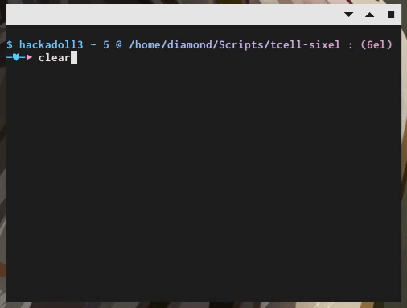
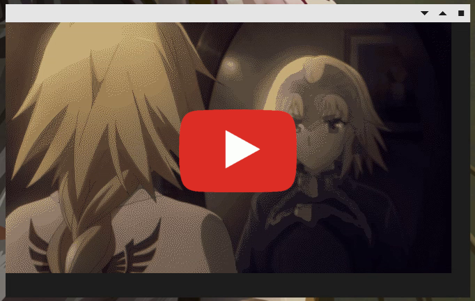

# tcell-sixel

Documentation: [pkg.go.dev](https://pkg.go.dev/github.com/diamondburned/tcell-sixel)

## Examples

**Note**: None of the images shown in these videos/animations were made by me.
They're also not included in the repository. The user must supply their own
assets when running these examples.

### [Floating](_example/floating)

A simple example that demonstrates 3 kinds of absolute-positioned images: an
inline image, a regular large image and a GIF.

### [DVD](_example/dvd)

A DVD bouncing demo.

### [Player](_example/player)

This example allows running a command to stream video into a terminal. Below is
a demo of an anime opening being played back.

## Features

- [x] Arbitrary positioning image support
- [x] GIF animations support
- [x] Asynchronous image resizing
- [ ] Grey box screen fallback
